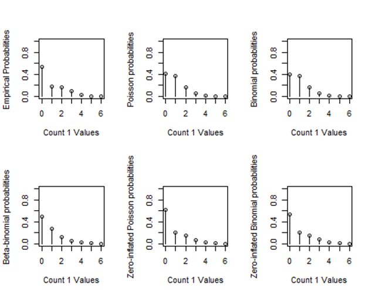
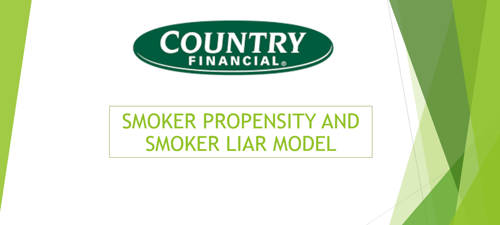
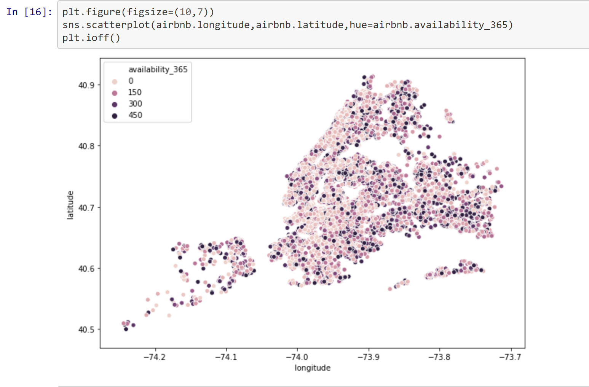

As an honors student in Mathematics, I am currently doing a research with [Dr. Potgieter](http://www.cjpotgieter.com/research/). The topic: Modeling of Reading Accuracy Data for Elementary School Children. The complete program can be found [here](https://github.com/mithu170900/Statistics-Measurement-Errors)

As a CodePath iOS student, here is my pre-work assignment for application. As the class proceeds, I will continue updating the UX/UI design and adding on more advanced features. Stay tune! I will keep updating my tip calculator app [here](https://github.com/mithu170900/TipCalculator)

Last summer, I interned as a data scientist at [COUNTRY Financial](https://www.countryfinancial.com/en/about-us/careers.html). I learned a lot about data science and machine learning, especially in predictive modeling. Some of the machine learning algorithms we used were logistic regression, random forest, and XGBoost. My complete program can be found [here](https://github.com/mithu170900/Smoker-Propensity-and-Smoker-Liar-Detection). Here is the final presentation I delivered to the leadership team, which I was super proud of. [Link](https://github.com/mithu170900/Smoker-Propensity-and-Smoker-Liar-Detection/blob/master/Smoker%20Propensity%20and%20Smoker%20Liar%20Detection.pdf).

After my first summer internship at COUNTRY Financial, I've developed an interest in data science and decided to pursue it as a career. I did a side project that predicted New York Airbnb Housing Price. The project is [here](https://github.com/mithu170900/AirBnBProject)

